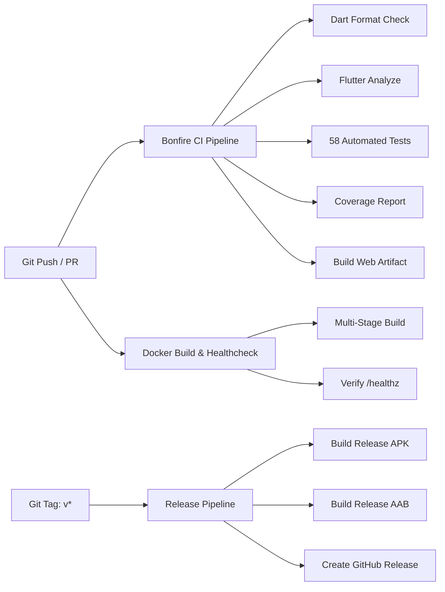

# 🔥 Bonfire — Alışkanlık & İrade Motoru (Gamified Habit Engine)

<div align="center">

[](https://flutter.dev)
[](https://dart.dev)
[](https://www.docker.com/)
[](https://github.com/abdulkadirguntav/Bonfire/actions)
[](https://github.com/abdulkadirguntav/Bonfire)
[](LICENSE)

<p align="center">
  <b>"Apple Minimalizmi"</b> ile <b>"Dark Souls Stoacı Disiplinini"</b> harmanlayan, modern DevOps standartlarıyla geliştirilmiş açık kaynaklı mobil alışkanlık ve irade takip platformu.
</p>

</div>

---

## 📌 Proje Hakkında & Vizyon

**Bonfire**, geleneksel renkli ve dikkat dağıtıcı yapılacaklar listesi (To-Do) uygulamalarının aksine, alışkanlık kazanmayı ve irade terbiyesini kadim bir hayatta kalma mekaniğine dönüştüren bir mobil uygulamadır.

- **Tasarım Felsefesi:** Saf siyah yerine derin kül grisi (`#0E1013`), yarı saydam koyu yüzeyler (`#1A1C23`), soluk altın aksanlar (`#C8A97E`) ve kadim **Cinzel** tipografisi.
- **Mühendislik & DevOps Standartları:** Clean Layered Architecture, Riverpod reaktif durum yönetimi, Docker Multi-Stage dağıtımı, GitHub Actions CI/CD otomatik test ve yayın boru hatları.

---

## ⚔️ Temel Oyunlaştırma ve Uygulama Mekanikleri

```
  ┌─────────────────────────────────────────────────────────────┐
  │                        BONFIRE HUB                          │
  ├───────────────────┬───────────────────┬─────────────────────┤
  │ Sınıf Sistemi     │  Kül İzi & Ölüm   │  Uzun Vadeli Boss   │
  │ (Mage/War/Pris)   │  (Ash Mark Reclaim)│  (30->90->180->365) │
  ├───────────────────┼───────────────────┼─────────────────────┤
  │ Kadim Fırın       │  Stoacı Günlük    │  Android Widget &   │
  │ (Özel Eşyalar)    │  (Soapstone/Refl) │  Yerel Bildirimler  │
  └───────────────────┴───────────────────┴─────────────────────┘
```

1. **Karakter Sınıfları & Stat Dağılımı:**
   - **Büyücü (Mage):** 150 Can, 50 Stamina, 0.75x Ceza Hasarı — *Alışkanlık bilinci yeni başlayanlar için.*
   - **Savaşçı (Warrior):** 100 Can, 100 Stamina, 1.0x Ceza Hasarı — *Dengeli bir yol arayanlar için.*
   - **Mahkum (Prisoner):** 50 Can, 150 Stamina, 1.25x Ceza Hasarı, 1.5x Öz Kazancı — *Gerçek meydan okuma.*
2. **Ölüm, Kül İzi (Ash Mark) ve Yeniden Doğuş:**
   - Can 0'a düştüğünde oyun biter, ölüm ekranı belirir. Kazanılan Özler yere düşer ve hedef gün serisine ulaşarak geri alınmayı bekler (**Dark Souls kan lekesi mekaniği**).
3. **Kadim Fırın (Pazar & Envanter):**
   - Yalnızca Bonfire günlerinde açılan seyyar tüccardan *Estus Şişesi*, *Kül Estusu*, *Arınma Taşı*, *Zaman Mührü* ve *Fedakarlık Yüzüğü* satın alınabilir.
4. **Android Ana Ekran Widget'ı & Çevrimdışı Bildirimler:**
   - Günlük stoacı motivasyon alıntıları sunan widget altyapısı ve cihaz yeniden başlasa bile çalışan arka plan hatırlatıcı alarmları.
5. **Çift Dil Desteği (i18n):**
   - Cihazın sistem diline göre otomatik olarak saf Türkçe veya saf İngilizce arayüz.

---

## 🏗️ Mimari & Proje Yapısı

Proje, **Domain-Driven Design (DDD)** ve **Clean Architecture** prensiplerine uygun olarak katmanlı bir şekilde yapılandırılmıştır:

```
lib/
├── core/
│   ├── constants/         # Günlük motivasyon sözleri ve kadim alıntılar
│   ├── localization/      # Türkçe / İngilizce otomatik yerelleştirme (AppLocalizations)
│   ├── services/          # Bildirim servisi (NotificationService & Timezone Alarms)
│   ├── theme/             # Apple x Dark Souls renk paleti (AppPalette, Google Fonts)
│   └── widgets/           # Ortak minimalist bileşenler (BonfireLogo, DetailedHpBar vb.)
├── data/
│   └── repositories/      # SharedPreferences ve yerel kalıcılık katmanı
├── domain/
│   ├── models/            # Saf iş modelleri (User, Task, Boss, AshMark, ShopItem vb.)
│   └── services/          # İş kuralları (DayResolution, DeathService, AttributeService)
├── presentation/
│   ├── providers/         # Riverpod StateNotifier ve AsyncNotifier sağlayıcıları
│   ├── screens/           # Ekranlar (Home, Shop, Reflection, Journey, AshenRecord, Death)
│   └── widgets/           # Ekrana özgü UI bileşenleri (TaskBottomSheet, SoapstoneCard)
└── main.dart              # Uygulama başlangıç noktası ve bağımlılık enjeksiyonu
```

---

## 🐳 Docker & Konteynerizasyon

Bonfire Web sürümü, hafif ve güvenli **Multi-Stage Dockerfile** ile paketlenmiştir:

### 1. Docker İmajını Derleme
```bash
docker build -t bonfire:latest -f Dockerfile .
```

### 2. Konteyneri Başlatma
```bash
docker run -d -p 8080:80 --name bonfire_app bonfire:latest
```
Uygulamayı tarayıcınızda açın: `http://localhost:8080` (Sağlık kontrolü: `http://localhost:8080/healthz`)

### 3. Docker Compose ile Çalıştırma
```bash
# Web uygulamasını arka planda başlatma
docker compose up -d bonfire-web

# Konteyner içinde izole test ve statik analiz çalıştırma
docker compose run --rm bonfire-ci
```

---

## 🔄 CI/CD & DevOps Otomasyonu

GitHub Actions üzerinde çalışan 3 adet otomatik boru hattı bulunmaktadır:



1. **`ci.yml`**: Her `push` ve `pull_request` tetiklendiğinde statik kod analizi (`flutter analyze`), format denetimi, 58 birim/entegrasyon testi ve Web bundle derlemesini çalıştırır.
2. **`docker.yml`**: Docker Multi-Stage imajını derler ve konteyneri ayağa kaldırarak `/healthz` uç noktasının HTTP 200 döndüğünü otomatik olarak doğrular.
3. **`release.yml`**: `v1.0.0` gibi bir sürüm etiketi atıldığında otomatik olarak Android Release APK ve App Bundle derleyip GitHub Releases altında yayımlar.

---

## 🚀 Yerel Geliştirme & Kurulum

### Gereksinimler
- **Flutter SDK:** 3.29.0 veya üzeri ([Flutter İndir](https://flutter.dev))
- **Dart SDK:** 3.7.0 veya üzeri
- **Java JDK:** 17 (Android derlemeleri için)
- **Docker & Docker Compose** (Konteyner çalıştırmaları için)

### Adım Adım Kurulum
```bash
# 1. Depoyu klonlayın
git clone https://github.com/abdulkadirguntav/Bonfire.git
cd Bonfire

# 2. Geliştirme dalına geçin
git checkout dev

# 3. Bağımlılıkları yükleyin
flutter pub get

# 4. Uygulamayı yerel cihazda/emülatörde çalıştırın
flutter run
```

---

## 🧪 Test & Kalite Güvencesi

Projede tüm iş kurallarını kapsayan 58 adet otomatik birim ve entegrasyon testi bulunmaktadır:

```bash
# Tüm testleri çalıştırma
flutter test

# Test kapsamı (Coverage) raporu üretme
flutter test --coverage

# Tek komutla DevOps CLI üzerinden tüm CI adımlarını doğrulama
./scripts/devops.sh ci
```

---

## 🌿 Git & Dallanma Stratejisi (DevOps Workflow)

- **`main`**: Yalnızca üretime hazır, testleri geçmiş kararlı sürümler.
- **`dev`**: Ana geliştirme dalı. Tüm özellik ve hata düzeltmeleri buradan dallanır.
- **`feature/*`**: Yeni yetenek ve geliştirmeler için açılan geçici dallar.
- **`fix/*`**: Hata giderme ve iyileştirme dalları.

---

## 📜 Lisans

Bu proje [MIT Lisansı](LICENSE) altında lisanslanmıştır.
